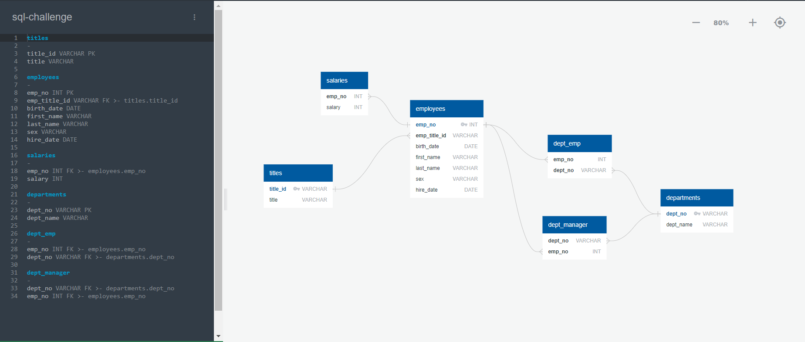
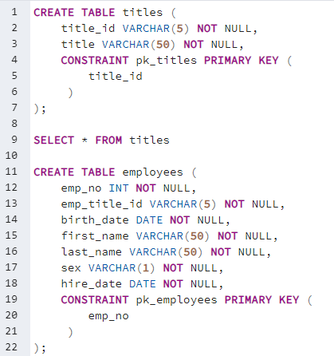
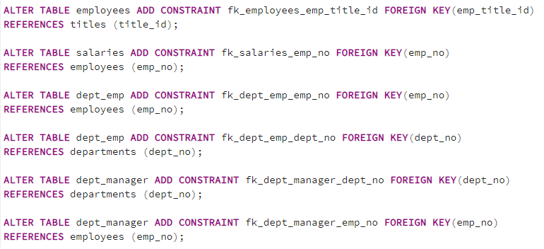
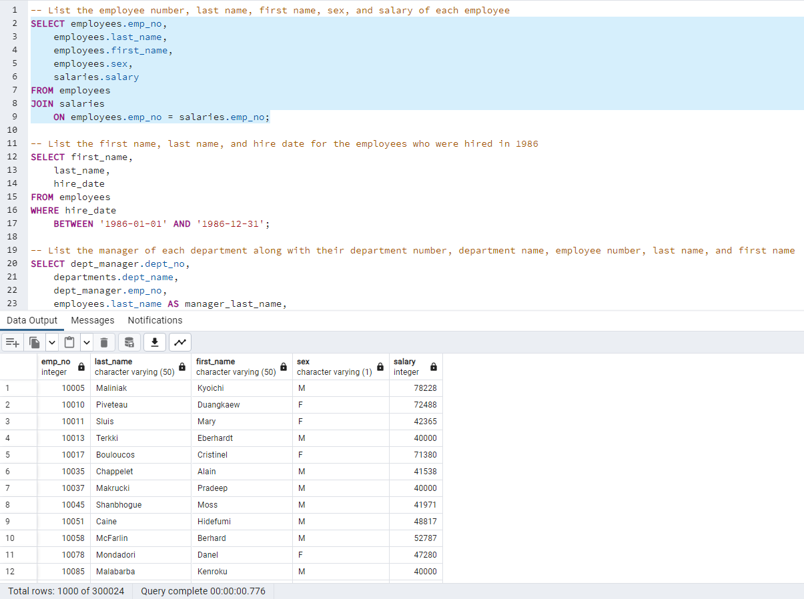
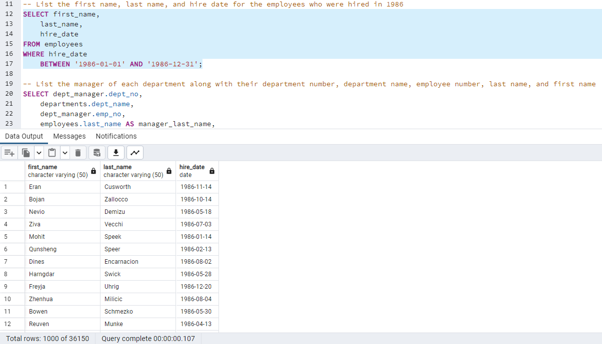
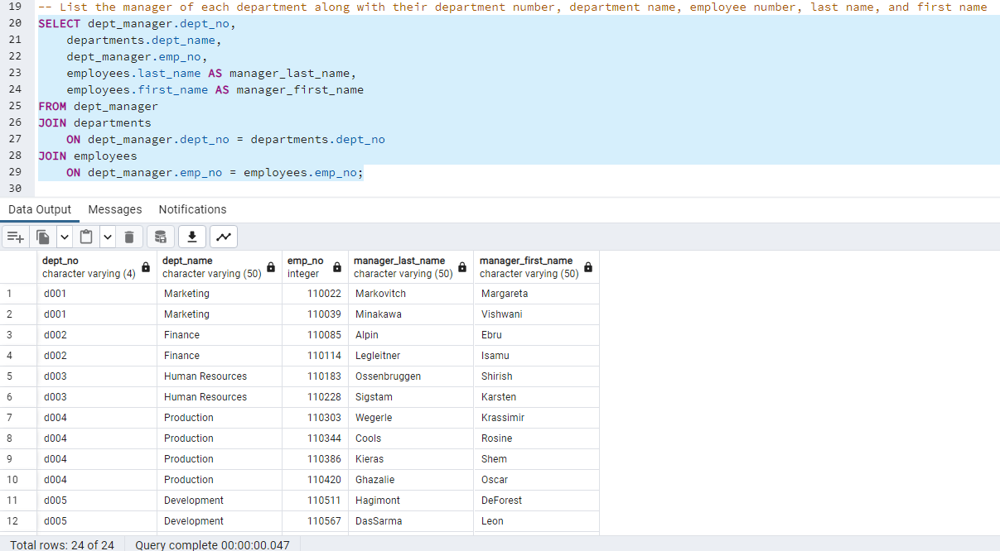
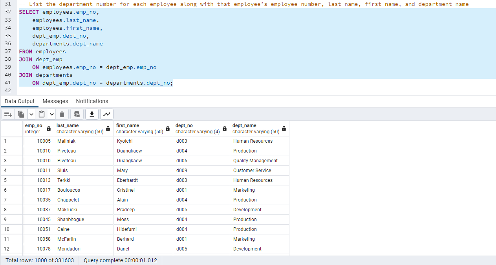
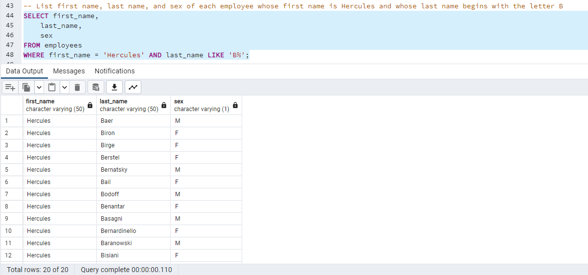
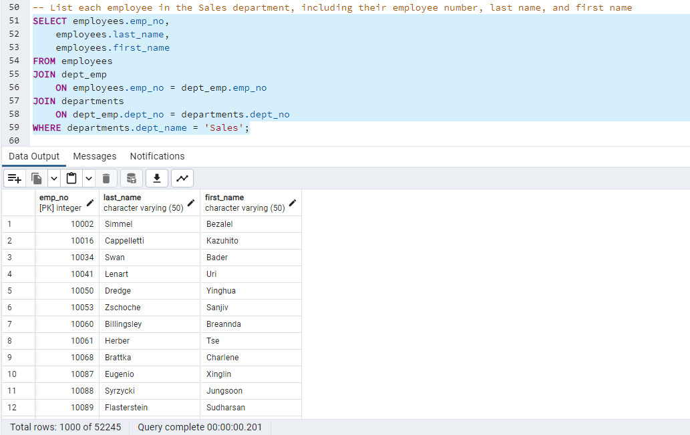
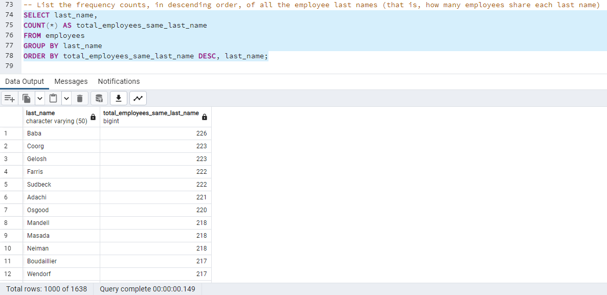

# SQL Challenge: Module 9

## Objective

The goal for this challenge was to use PostgreSQL to demonstrate data modeling, data engineering, and data analysis by creating a database using the starter .csv files of employees, department information, and salaries.

### Data Modeling
This project required using an ERD to plot out a coherent schema that properly ties together the various tables using proper primary and foreign keys, for which attributions can be found below.

 

### Data Engineering

After creating a schema, the tables were generated with imported csv files accounting for pre-existing headers. Afterwards, the tables needed to have Alter Table and Add Constraint added to properly reference the foreign keys between the tables according to the schema. Tables were also generated with value limits, whenever possible, to cut down on the overall size of the database. Included below are examples of the code used:

 

 

### Data Analysis

After properly generating tables using the developed schema, a second query was created to answer the challenge questions. For convenience, screenshots of the code and their corresponding truncated results are included below:

 

 

 

 

 

 

 

 

## Attributions

The ERD was generated using:  
- https://app.quickdatabasediagrams.com/ 
